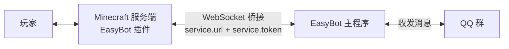

<p align="center">
  
</p>

<h1 align="center">EasyBot-Bukkit</h1>

<p align="center">EasyBot 的 Bukkit / Spigot / Paper 桥接插件：把 Minecraft 服务器接入 EasyBot 主程序，实现 QQ 群与游戏内的双向消息互通、账号绑定、群聊登录等联动能力。</p>

<p align="center">
  <a href="https://github.com/easybot-team/easybot-bukkit/releases"></a>
  
  
</p>

> `main` 分支为稳定版，`dev` 分支为开发版（当前 2.4.0，已适配 Paper 26.3）。

<p align="center">
  <a href="#功能">功能</a> ·
  <a href="#工作方式">工作方式</a> ·
  <a href="#运行环境">运行环境</a> ·
  <a href="#可选联动插件">可选联动插件</a> ·
  <a href="#安装">安装</a> ·
  <a href="#命令与权限">命令与权限</a> ·
  <a href="#配置说明">配置说明</a> ·
  <a href="#从源码构建">从源码构建</a> ·
  <a href="#项目结构">项目结构</a> ·
  <a href="#发布流程">发布流程</a> ·
  <a href="#相关项目">相关项目</a> ·
  <a href="#相关链接">相关链接</a>
</p>

---

## 功能

- **账号绑定**：游戏内 `/easybot bind` 生成验证码，群内发送「绑定 #code」完成绑定；已绑定时会先列出社交平台账号并要求确认，避免重复绑定
- **消息同步**：群与服务器双向同步，支持 @ 提醒（Title、提示音）、图片（ChatImage）、`/esay` 主动发消息
- **玩家事件**：加入 / 退出 / 死亡（含死因与凶手）同步到群
- **登录联动**：AuthMe（含 6.0 的 **PreJoinDialog 预登录对话框**，可在对话框内完成群聊登录）、LibreLogin 登录状态判定
- **聊天插件适配**：VentureChat / RedisChat / PlayerChat 对接各自事件；没有则使用 Paper `AsyncChatEvent` 或 Bukkit `AsyncPlayerChatEvent`
- **皮肤**：SkinsRestorer（需 PlaceholderAPI）或 Paper 皮肤 API
- **假人过滤**：识别 [minecraft-fakeplayer](https://github.com/tanyaofei/minecraft-fakeplayer) 的假人，不同步假人数据
- **基岩版**：Geyser + Floodgate，支持基岩版玩家名前缀处理
- **ItemsAdder**：自定义物品 / 表情识别
- **PlaceholderAPI**：内置 `easybot` 扩展，并提供离线玩家变量
- **命令执行**：优先使用高版本命令接口，也可改用原生 RCON
- **i18n**：按服务端版本自动下载官方语言文件，把原版消息（死亡、成就等）翻成中文
- **Folia 支持**：`plugin.yml` 中已标注 `folia-supported: true`

## 工作方式



- 插件通过 WebSocket 长连接与 **EasyBot 主程序**通信，由主程序负责与 QQ 群收发消息
- 主程序下发命令时，插件通过**高版本命令接口**（优先）或**原生 RCON** 在服务端执行
- 玩家进服、聊天、死亡等事件由插件上报，群消息与游戏消息双向同步

## 运行环境

| 项目 | 要求 |
| --- | --- |
| Java | **8 及以上** |
| 服务端 | Paper / Spigot 等 Bukkit 系，API **1.13 ~ 26.3**（已在 Paper 26.3 build 41 + Java 25 实测） |
| 前置 | **EasyBot 主程序**（提供 `ws://` 桥接地址与服务器 token） |

> [!NOTE]
> 插件编译目标是 **Java 8 字节码**，因此老服务端也能加载；服务端为 **Paper** 时可获得最完整的能力
> （AuthMe 预登录对话框、`AsyncChatEvent` 消息同步等都依赖 Paper 接口）。

## 可选联动插件

| 插件 | 作用 | 备注 |
| --- | --- | --- |
| [PlaceholderAPI](https://github.com/PlaceholderAPI/PlaceholderAPI) | 变量、皮肤取值 | 推荐安装 |
| [AuthMe](https://github.com/AuthMe/AuthMeReloaded) | 群聊登录、预登录对话框 | 6.0+ 支持 Dialog |
| [LibreLogin](https://github.com/kyngs/LibreLogin) | 登录状态判定 | |
| [SkinsRestorer](https://github.com/SkinsRestorer/SkinsRestorer) | 玩家皮肤 | 需 PlaceholderAPI |
| [ItemsAdder](https://www.spigotmc.org/resources/73345/) | 自定义物品 | 需配合 LoneLibs |
| [Geyser](https://geysermc.org/) + [Floodgate](https://geysermc.org/) | 基岩版玩家 | `geyser.ignore_prefix` 控制前缀 |
| VentureChat / RedisChat / PlayerChat | 聊天事件对接 | PlayerChat 需 **v1.1.7+**；RedisChat 需 CommandAPI + Redis；**VentureChat 需 Vault + 一个权限插件，否则它会自我禁用**（实测） |
| Vault（+ 经济、权限插件） | 同步消息扣费 | |
| [minecraft-fakeplayer](https://github.com/tanyaofei/minecraft-fakeplayer) | 假人识别 | 需 CommandAPI |

> [!WARNING]
> 聊天类插件都有前置条件，装错会导致消息同步静默失效：
>
> - **VentureChat**：需要 Vault + 一个权限插件（如 LuckPerms），否则它会**自我禁用**，EasyBot 也就接不到 `VentureChatEvent`
> - **PlayerChat**：需 **v1.1.7 及以上**，版本过低会回退到原版事件
> - **RedisChat**：需要 CommandAPI 与一个可用的 Redis 服务

> [!NOTE]
> `TrChat` 也声明在 `plugin.yml` 的 softdepend 中，但当前版本未对接它的事件，聊天消息会退回原版事件处理。

## 安装

1. 从 [Releases](https://github.com/easybot-team/easybot-bukkit/releases) 下载 `EasyBot-<版本>.jar`（尝鲜可用 `latest-dev` 预发布）
2. 把 jar 放进服务端 `plugins/` 目录
3. 启动一次服务端，生成 `plugins/EasyBot/config.yml`，填入主程序里创建的 **桥接地址** 与 **token**
4. 重启服务端，或在游戏内执行 `/easybot reload`

> [!IMPORTANT]
> `service.ignore_error` 默认为 `false`，表示**连不上主程序时禁止玩家登录**（适合把 QQ 群当作登录白名单的场景）。
> 只想做消息同步、不希望在断连时影响玩家登录的话，把它改成 `true`。

## 命令与权限

| 命令 | 说明 | 权限 |
| --- | --- | --- |
| `/easybot bind` | 生成绑定验证码（已绑定时先列出账号并需点击确认） | `easybot.command.bind` |
| `/easybot bind confirm` | 确认继续生成验证码 | `easybot.command.bind` |
| `/easybot reload` | 重载配置（仅 OP / 控制台） | OP |
| `/esay <消息>` | 以玩家（或控制台）身份把消息发到群里 | `easybot.command.esay` |

## 配置说明

配置文件位于 `plugins/EasyBot/config.yml`，改完可以用 `/easybot reload` 热重载。

| 配置项 | 说明 |
| --- | --- |
| `service.url` / `service.token` | EasyBot 主程序提供的桥接地址与服务器 token |
| `service.ignore_error` | 连不上主程序时是否放行玩家登录（`false` = 禁止登录） |
| `service.update_notify` | 是否接收插件更新推送 |
| `command.allow_bind` | 是否允许在本服务器执行绑定 |
| `message.*` | 绑定开始 / 成功 / 失败、同步成功的提示文本（支持 `#code` `#time` `#account` `#name` `#why` 占位） |
| `event.enable_success_event` + `event.bind_success` | 绑定成功后在控制台执行命令（`$player` `$account` `$name`） |
| `event.on_at.*` | 群内 `@` 玩家时的 Title / 提示音 / 模糊匹配 |
| `debug` | 调试日志（反馈问题时建议开启） |
| `skip_options.*` | 屏蔽 加入 / 退出 / 聊天 / 死亡 的同步 |
| `adapter.native_rcon.*` | 改用原生 RCON 执行命令（`use_native_rcon`、`address`、`port`、`password`） |
| `geyser.ignore_prefix` | 是否去掉 Floodgate 基岩版玩家名前缀 |
| `sync.chat_image_support` | 消息同步是否支持 ChatImage 图片 |

## 从源码构建

```bash
./gradlew shadowJar
# 产物：build/libs/EasyBot-<version>.jar
```

- 编译使用 **JDK 25 toolchain**（Gradle 会自动下载或用本机 JDK 25），字节码目标仍是 **Java 8**
- `com.springwater.easybot:easybot-bridge` 发布在 **GitHub Packages**，本地构建需要凭据：`USERNAME` + 具备 `read:packages` 权限的 `TOKEN`

<details>
<summary>展开：没有 PAT 时如何本地构建（改用 mavenLocal）</summary>

先把 bridge 装进本地 Maven 仓库，例如从公开源码构建：

```bash
./gradlew publishToMavenLocal
```

再用 init 脚本把 `mavenLocal()` 注入依赖解析：

```groovy
// init-m2.gradle
allprojects {
    repositories {
        exclusiveContent {
            forRepository { mavenLocal() }
            filter { includeModule("com.springwater.easybot", "easybot-bridge") }
        }
    }
}
```

```bash
./gradlew -I init-m2.gradle shadowJar
```

</details>

> [!CAUTION]
> `libs/` 里放的是编译期 API（例如 `paper-api-26.3.build.41-alpha.jar`）。Gradle 的 `fileTree` 解析**同名类先到先得**：
> 升级服务端 API 时务必删掉旧 jar，否则新 API 会被旧版本压住。

## 项目结构

```
src/main/java/com/springwater/easybot/
├── api/       对外 API
├── command/   /easybot、/esay 命令
├── event/     玩家事件、消息同步事件（Paper / Bukkit / VentureChat / RedisChat / PlayerChat）
├── hook/      事件挂钩与回调注入（含 BukkitEventHooks、SendMessageHooks）
├── i18n/      语言文件下载与翻译（vanilla.json）
├── papi/      PlaceholderAPI 扩展（含离线变量）
├── rcon/      原生 RCON 客户端
├── task/      定时任务（玩家状态上报等）
└── utils/     兼容与工具（CompatUtils、AuthMeUtils、SkinUtils、FakePlayerUtils 等）
```

## 发布流程

- 推送到 `dev` 后由 GitHub Actions 自动构建，并更新 `latest-dev` 预发布
- 在 GitHub 发布 Release 后由 Actions 构建并上传 jar 资产

## 相关项目

同一组织下还有其它端的实现，配置与功能保持一致：

| 项目 | 说明 |
| --- | --- |
| [easybot-bridge](https://github.com/easybot-team/easybot-bridge) | 主程序与服务器的通信协议（本插件的依赖） |
| [Easybot-Velocity](https://github.com/easybot-team/Easybot-Velocity) | Velocity 代理端版本 |
| [easybot-mod](https://github.com/easybot-team/easybot-mod) | Mod 端实现 |
| [easybot-mcdr](https://github.com/easybot-team/easybot-mcdr) | MCDR 群服同步插件 |
| [easybot-legacyforge](https://github.com/easybot-team/easybot-legacyforge) | 社区项目：Forge 1.12.2 版本 |
| [EzbotSup](https://github.com/easybot-team/EzbotSup) | 一键安装 / 部署工具 |
| [easybot-issues](https://github.com/easybot-team/easybot-issues) | 各端问题的统一收集仓库（**请在这里反馈问题**） |

## 相关链接

> [!TIP]
> 遇到 Bug 或想提功能建议，请到 **[easybot-issues](https://github.com/easybot-team/easybot-issues/issues/new/choose)** 提交（官方统一收集各端问题）。
> 附上服务端版本、插件版本，并把 `config.yml` 里的 `debug` 设为 `true` 后复现一次、附上后台日志，定位会快很多。

- 使用文档：<https://docs.hualib.com/>
- 上游仓库：<https://github.com/easybot-team/easybot-bukkit>
- 问题反馈：[easybot-team/easybot-issues](https://github.com/easybot-team/easybot-issues/issues)
- Logo 素材：取自同组织的 [easybot-mod](https://github.com/easybot-team/easybot-mod) 模组图标（`docs/logo.png`）

> [!NOTE]
> 本仓库暂未包含 LICENSE 文件，二次分发或商用前请先与作者确认授权。

---

<p align="center"><sub>EasyBot-Bukkit · 使用文档 <a href="https://docs.hualib.com/">docs.hualib.com</a> · 问题反馈 <a href="https://github.com/easybot-team/easybot-issues/issues">easybot-issues</a> · 由 <a href="https://github.com/easybot-team">easybot-team</a> 维护</sub></p>
